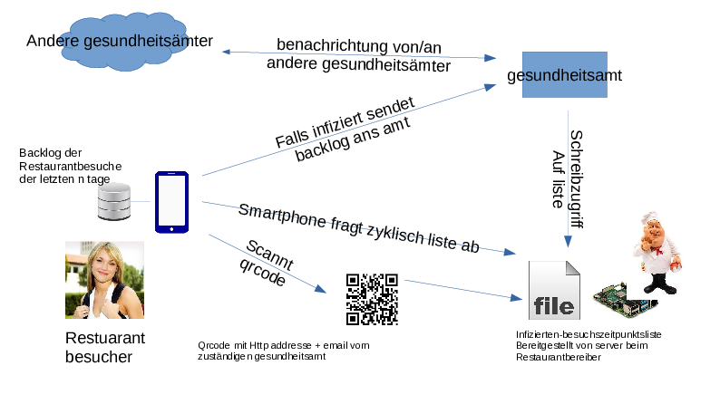

# !! offene Arbeiten !! #

* Handy App. Nötige Kenntnisse: 
    * plaintext aus einem QR-Code extrahieren,
    * plaintext in einer sqlite(?) db mit timestamp speichern, alte einträge aus
      der db löschen.
    * zyklisch mal eine liste an textdateien aus dem Internet herunterladen.
* Beamten-gerechte GUI
    * abwärtskompatibel zu Windows XP
    * textdateien verarbeiten
    * ssh verbindung aufbauen, automatisiert Text reinpasten und wieder schließen

Server infrastruktur und cmd line client ist soweit fertig.

# yet another Corona Warn App #

Hier in Deutschland gibt es gerade zwei Wege, wie wegen corona zurückverfolgt
wird. Die CWA app von SAP will niemand installieren, weil egal wie mans macht
ist es falsch. da kann man sich auch gleich von Bill Gates chippen lassen. Und
auch niemand hat lust bei jedem Restaurantbesuch das DeHoGa-Formular auszufüllen
(bzw. dass der gastwirt umbedingt wissen muss wo mein Fahrrad wohnt).

Wenn SAP 2mrd maintenance dafür braucht, kriegt man das bestimmt auch in richtig
echt dezentral mit ein paar shellskripten und der etwas unterstützung für die
GUI/Clientsoftware von einer Computer AG hin.

## Infrastruktur ##

Deswegen schlage ich folgende Serverinfrastruktur für gegen Corona vor:

Es gibt hier drei Akteure:

* das Gesundheitsamt
    * hat ssh-zugriff auf die RPi vom Restaurantbesitzer, beim anmelden via key
      wird das sick_update.py skript anstatt eine shell ausgeführt, und die
      verbindung dann beendet.
    * Die Computer AG kann dann ne GUI schreiben, die alle RPis der
      Restaurantbesitzer anfunkt.
    * bekommt von infizierten Bürgern eine liste mit besuchten Restaurants
* der Restaurantbesitzer...
    * stellt sich eine RPi mit den Skripten in `restaurant_server` ins Haus und der
      Enkel^W Telekom-Servicetechniker^W^W irgendeiner richtet eine
      Portweiterleitung für ssh/http auf die RPi ein. 
    * HTTP um auf die corona.txt datei zuzugreifen, zu welchen zeitpunkten jemand
      infiziertes da war.
    * SSH damit der Beamte vom Gesundheitsamt Zeitpunkte zu denen Infizierte im
      laden waren in der corona.txt appenden kann.
    * druckt nen zettel mit nem qrcode aus und verteilt den mit der Speisekarte.
      Auf diesem QRcode befindet sich die URL von der RPi und eine E-Mail vom
      zuständigen Gesundheitsamt.
* der Besucher vom Restaurant (also alle anderen)
    * installiert eine App, die lokal auf dem Handy daten speichern und auf die
      kamera zugreifen will
    * scannt den QRcode vom Restaurantbesitzer, sodass das handy für
      $ansteckungszeit lange, speichert, dass man zum Zeitpunkt im Restaurant war.
    * meldet sich beim arzt/gesundheitsamt/woauchimmer, wenn er zum selben
      zeitpunkt im selben restaurant war wie ein corona infizierter.
    * Wenn er sich ansteckt sendet er seine Liste von Restaurantbesuchen an das
      Gesundheitsamt da wo er wohnt.
* Bill Gates
    * ka, wie ich den hier unterbringe.
